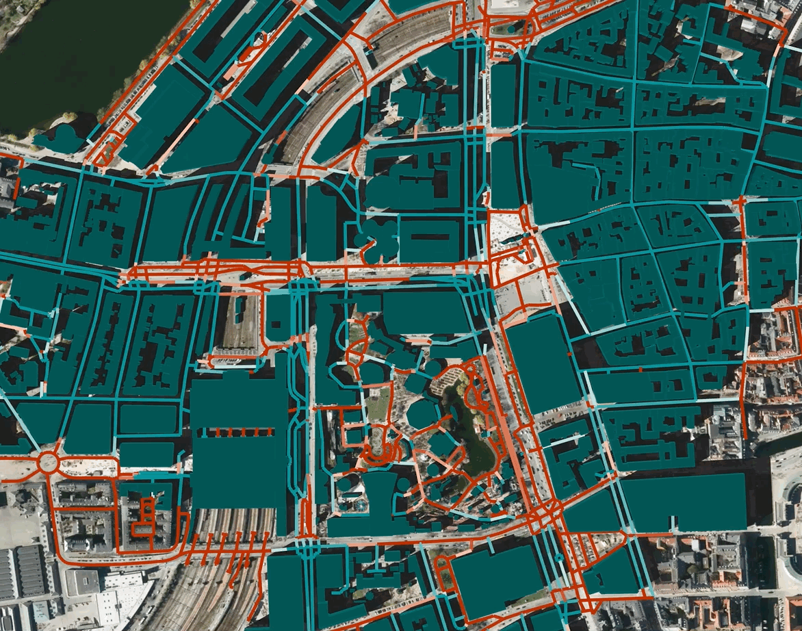

# Shadow routes

[introduction to proejct] :)

## Utilities

### Extracting building geometries
Buildings are modeled using the exsisting 2D footprints from OpenStreetMap (OSM) as a base. Since data on building heights is scarce in OSM, we extract them manually. With high-precision elevation maps based on LIDAR scans [(Danmarks Højdemodel - DHM)](https://kortviseren.dk/side/hoejdemodeller.html), we sample the surface elevation for areas overlaid by the building outlines, using the median value as the definitive height for the entire geometry. 

1. `modeling/preprocess_raster_data.py` \
    Preprocessing specific for working with tiled raster data from [DHM](https://dataforsyningen.dk/data/930) (GeoTIFF)
    
2. `modeling/osmnx_map.py` \
    Fetches building geometries from OSM and estimates their height based on local GeoTIFF rasters encoding elevation

3. `modeling/project_shadow.py` \
    Generates shadow geometries given extruded building footprints and timestamp. See [pybdshadow](https://github.com/ni1o1/pybdshadow)
    
    ### Demo
    
